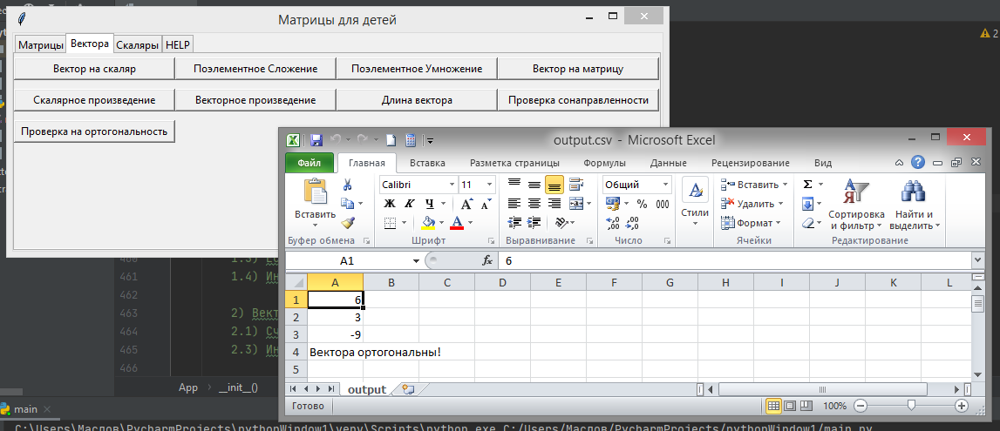
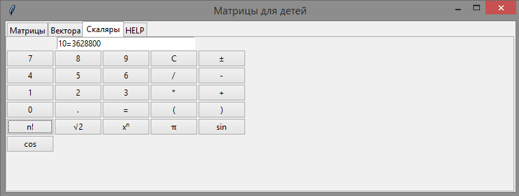
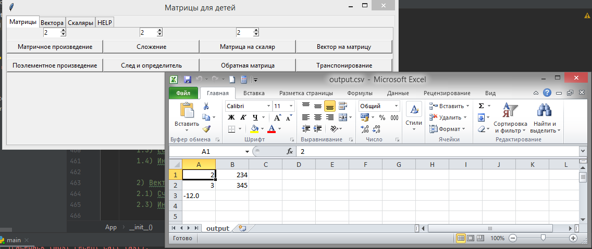

Простая программа для выполнения математических преобразований над скалярными, векторными и тензорными величинами: скалярами, векторами и матрицами.При разработке пробраммы необходимо использовать ООП.

О программе:
Графическая оболочка реализована с помощью GUI tkinter, вывод данных происходит в excel файл.

    
    
Пример проверки ортогональности

    
    
Пример работы со скалярами

    
    
Пример расчёта определителя

